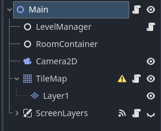

<!-- TABLE OF CONTENTS -->
<details>
  <summary>Table of Contents</summary>
</details>

<br>

## Important Resources
Resources in Godot 4.4 act as data containers, nodes pull from them in order to do things like hold variables and arrays and lists. The ability to create custom resources is a very valuable tool in the arsenal of any godot dev. <br> In this section, I'll go over the prominent resources I've created and used through out the project and where I've used them to get a better picture of how each part plays into the larger project. 

### Reoccurring variables
Present in these resources are two types of labels, with the same functions. For brevity's sake, I'll define them before delving deeper.

* **Type**: A type of list holding strings of information, usually what kind of object the resource is attached to.
* **Art**: The short hand for 2D texture, to be grabbed later by the object's script.

### Stats


The stats resource class holds components related to the node's it'll be attached to later on. If it's got "health" to speak of, it has data from or inheriting from this resource.  
<br>
#### Variables
 ```sh
class_name Stats	
extends Resource

enum Type{PLAYER,MONSTER,INTERACTABLE}

@export var type: Type
@export var max_health := 1
@export var art: Texture
@export var damage: float
  ```
The exported variables represent these things as follows:
* **Max_health**: Maximum amount of health
* **Damage**: How much an (unarmed) attack will deal upon contact


#### Export group

```sh
@export_group("Item drops")
@export var drops: Array[DropData]
```
The Item Drops group below carries an array of what "Items" the object can "Drop". 
Not all objects with the stats resource attached to them have items that it can drop, this only applies specifically to enemies and chests/rocks.
<p>read more about <a href="#Dropdata">DropData</a> here</p>


#### Health
```sh
var health: int : set = set_health ## CURRENT health, different from total health

 
func set_health(value : int) -> void:
	health = clampi(value, 0, max_health)
	
func take_damage(damage : int) -> void:
	if damage <= 0:
		return
	self.health -= damage
```
If it has health, it can lose health as well. These two functions keep track of both of these. 
take_damage takes from the health based off of an assigned value when the function is called.


```sh	
func create_instance() -> Resource:
	var instance: Stats = self.duplicate()
	instance.health = max_health
	return instance
```
<p>By duplicating the resource here, I can instance the data into the scene. This allows it to be modified and used for multiple objects without messing with the original container. When duplicating these stats, the function makes sure the object's health is at the maximum.</p>

#### Player's stats
```sh
class_name Character_stats
extends Stats

@export var max_stamina:= 1
var stamina: int : set = set_stamina

func set_stamina(value : int) -> void:
	stamina = clampi(value, 0, 999)
	
func add_stamina(amount : int) -> void:
	self.stamina += amount
	
func take_damage(damage: int) -> void:
	if damage <= 0:
		return
	super.take_damage(damage)

func create_instance() -> Resource:
	var instance: Stats = self.duplicate()
	instance.health = max_health
	instance.stamina = max_stamina
	return instance

```
Under a new file, character stats inherits from the stats class and uses most of the same logic.
* amount / damage is determined by a value to be assigned when called
* stamina opperates identically to health, when instanced into a scene both are at their maximum value


```sh
func heal(amount : int) -> void:
	self.health += amount
```
One new function present in the character stats is the addition of healing. It still takes in an amount to be assigned later, but replenishes health opposed to taking damage.


<br>


## Items
Items refers to collectables and weapons the player can interact with and craft. This section talks about the data the items generally hold for future reference. 
<p>Read more about <a href="#interactable-items">Interactable items</a> here.</p>

```sh
enum Type{COLLECTABLE, WEAPON}

@export_group("Item Attributes")
@export var type: Type
@export var art: Texture
@export var name: String
@export var stackable: bool
@export var max_stack: int
@export var animation : String


@export_multiline var item_desc: String
```
* stackable: if the player can hold the same item in one slot
* max_stack: how many of each item can be implemented in a single slot
* animation: item's animation name (if applicable)

  
### Weapon
```sh
@export var cost: int
@export var damage: float
@export var weapon_type: Weapon_type
@export var recipe: Array[Item_resource]
@export var rock_damage: float

func use_cost(char_stats: Character_stats) -> void:
	if cost:
		char_stats.stamina -= cost
```

* **cost**: how much stamina the weapon depletes when the player uses it each time
* **rock_damage**: How much damage does this inflict on chests/rocks as opposed to enemies?
* **recipe**: An array of existing item resources needed in order to craft the object

### Dropdata
```sh
class_name DropData 
extends Resource

@export var item : Item_resource
@export_range( 0, 100, 1, "suffix:%" ) var probability : float = 100
@export_range( 1, 10, 1, "suffix:items" ) var min_amount : int = 1
@export_range( 1, 10, 1, "suffix:items" ) var max_amount : int = 1
```
Mentioned previously, DropData stores data about item drops. 
<br>
This encompasses which item resource this is going to reference, the potential minimum and maximum amounts of items and the probability for an item to show up for more chance.

```sh
func get_drop_count() -> int:
	if randf_range( 0, 100 ) >= probability:
		return 0
	return randi_range( min_amount, max_amount )
```
The `get_drop_count` function underneath the establishing variables runs a check to see if a number rolled is greater than the given probability. 
<br>
If so, return the function, do not proceed. Otherwise, return a new random interger from the established minimum and maximum values.

<br>
<!-- SIGNALS -->

## Signals
In Godot, Signals are little messages emitted in order to indicate something's happening. There are multiple ways a signal could be listened for and used and overall make working within GDscript less of a headache. 

### Global Signals
Godot offers a way to automatically load nodes at the base of your scene globally, making for an easy way to access certain signals without having to define new ones for similar uses. this section overs the following  examples.

```sh
extends Node

signal weapon_changed
signal player_died
signal rock_broken
signal generate_dungeon
signal obj_placed
signal game_start
signal game_over

signal enemy_dead(object) ## currently unused
```
Main.gd acknowledges and listens for these signals in order to preform fuctions when emitted upon startup.
```sh
func _ready():
	Global.connect("game_start", _on_game_start)
	Global.connect("game_over", _on_game_over)
	Global.connect("player_died", retry)
	Global.connect("generate_dungeon", make_rooms)
```

### Position Generation
as a randomly-generated dungeon is created for the level's map, it's important that the items, enemy spawns and player position is generated at random as well. Signals are used to indicate when a new random position needs to be pulled up, opposed to the same position being used multiple times otherwise.
<br>
Below is code used on the main tilemaps for dungeon generation. This is located in `tile_map.gd` and can be seen attached to the tilemap node of the same name.

```sh
extends TileMap

var tiles_in_room = []
var rand_point

	
func _ready() -> void:
	Global.connect("game_over", clear_tiles)
	Global.connect("obj_placed", place_object)


func clear_tiles():
	tiles_in_room.clear()


func place_object() -> void:
	if tiles_in_room.is_empty():
		for tile in get_used_cells_by_id(0,0):
			tiles_in_room.append(tile) ##i'll figure something out later, this just puts the endbox on ANY tile the player can int with
	else: 
		pass
	rand_point = tiles_in_room.pick_random()
```
<p>This block of code also demonstrates that at the end of a level the array containing each position is cleared in order to ensure any one of the items generated isn't put in an impossible positon. Like the comment implies there are some flaws with this system, mainly that I can't control what goes where yet in case I really didn't want something to be some place. </p>


<br>

<!-- MAIN SECTION -->


## Main Scene
I've made sure to name the folder it's stored in `00_main` in order to keep the main scene at the top for ease of access.



Opening `main.tscn`, you find it holds the `RoomContainer`, `LevelManager`, `Screenlayers` and `TileMap`. 
<br>
Each of these elements contribute to the "background" elements that keep the game running, like a cog to a larger machine. In this case, some cogs are more polished than others.
I've referenced the `Main.gd` script here and there but this section will disect it's contents more thoroughly.

### Main Node

Some variables present were for testing purposes and have since been commented out. There are still reminants to what these variables refer to within the code, but we'll get there when we get there.

```sh
extends Node2D
class_name MainNode
## MAIN VARIABLES

var Room = preload("res://dungeon_generator/Room.tscn")
var Player = preload("res://Playable_character/character.tscn")
var font = preload("res://assets/fonts/RobotoBold24.tres")
var evil_rock = preload("res://item_test_scenes/evil_rock.tscn")
```
The beginning encompases the preloads. 
* **Room**: Holds the node that'll be instantiated in order to generate dungeons.
* **Player**: Contains the player scene with accompanying HUD
* **Font**: Carries the font resource used for text
* **evil_rock**: is weirdly named but functions as an end point the player meets in order to pass the level. Having this in the scene makes sure the player at least has a vauge goal throughout the prototype.

  
<br> 


```sh
@export var Map: TileMap
@onready var screen_layer: CanvasLayer = $ScreenLayers
@onready var textbox: MarginContainer = $ScreenLayers/textbox

var tile_size = 32 ## size of tiles
var num_rooms = 20 ## number of total rooms generated
var min_size = 4 ## min room size in tiles
var max_size = 15 ## max room size in tiles
var h_spread = 2000 ## horizontal spread in pixels
var v_spread =	800 ## vertical spread in pixels
```
This section covers the specifics of dungeon generating, from how many rooms there are in any given dungeon to the tileset used. This will be replaced with level management things in the future works a pretty solid placeholder.


<br>

```sh
func _ready():
	Global.connect("game_start", _on_game_start)
	Global.connect("game_over", _on_game_over)
	Global.connect("player_died", retry)
	Global.connect("generate_dungeon", make_rooms)
	Global.connect("level_passed", level_proceed)
	
	randomize()
	make_rooms()
```
When ready is called, the function listens for the established global signals and connects them to functions to the bottom of the script. 
<br>
These signals tell the program:
* **Game_start**: hen the level is generated
* **Game_over**: when a level needs to stop
* **Player_Died**: When a player has lost all it's health
* **Generate_dungeon**: to generate a dungeon
* **Level_passed**: to pass to the next level

<br>

```sh
func _on_game_over() -> void:
	play_mode = false
	player.queue_free()
	end_box.queue_free()
	screen_layer.show()
	
func _on_game_start() -> void:
	
	play_mode = true 
	get_node("Camera2D").enabled = false
	screen_layer.hide()
	

func retry() -> void:
	_on_game_over()
	Global.current_level = 0 

func level_proceed() -> void:
	Global.current_level += 1
```

`_on_game_over` as a function toggles off the play mode and removes the player and rock items from the scene. From there it shows the canvas layer, this conveys to the player that they've passed and presents them with a button to continue.

<br>

#### Dungeon Generation
How a dungeon is randomly generated is broken down into three steps. 
* Spawning the rooms
* Connecting the rooms
* Filling in the map with tiles.

  

<!-- ITEMS SECTION -->
## Interactable Items
Interactable items refers to the collectables that a player can pick up on their journey, these can be small pieces of loot, ore for crafting. The ptoject handles loose items by having one central pickup item code and changes the sprite texture based on the resource attached to the node via code.
```sh
extends CharacterBody2D
class_name PickableItem

signal picked_up

@onready var area_2d: Area2D = $Area2D
@onready var sprite_2d: Sprite2D = $Sprite2D
@export var item_data: Item_resource

func _ready() -> void:
	_update_texture()
	if Engine.is_editor_hint():
		return
	area_2d.body_entered.connect(_on_body_entered )
```
`item.gd`'s beginning half begins by establishing a few things, mainly the variables referenced throughout the script. The if statement present checks if the enginge's screen is the editor as opposed to the game and calls the update texture occordingly.

```sh
func _on_body_entered( b ) -> void:
	if b is PlayerCharacter:
		if item_data:
			emit_signal("picked_up")
			visible = false
			b.add_item(item_data)
			queue_free()
	pass	
```
the body entered function listens for the singal in the area 2D to detect if another body has entered the space. Upon this, the if statement checks if the body belongs the the `PlayerCharacter` class. If that requirement is met, it emits the established `picked_up` signal, removes visibility from the sprite and lastly, adds the item to the player's inventory. 

`add_item` function found in the `Character.gd` script:

```sh
func add_item(item):
	var inventory = $CanvasLayer/HUD_elements/BottomContainer/VboxContainer/MarginContainer/Inventory/Slot_Container/Inventory_Slots
	
	if inventory:
		inventory.add_item(item)
```
`add_item` function found in `inventory_slot.gd` script:
```sh
func add_item(item : Item_resource):
	for slot in slots:
		if slot.item == null:
			slot.item = item
			item_changed.emit()
			return
	print("Can't add any more item...")

```
### Items in the Overworld
Items do not currently spawn in the overworld in the main scenes, what's in this section details what's present in the projects test scenes. I felt it's important this game had a specific system where items in the map resources arrays show up and spawn randomly as opposed to having them all plop in individually. The latter is inflexible and cannot work for the type of game this is. 
<br>
```sh
func _physics_process(delta):
	var collision_info = move_and_collide( velocity * delta )
	if collision_info:
		velocity = velocity.bounce( collision_info.get_normal() )
	velocity -= velocity * delta * 4 
	
```

when an enemy drops an item, each item has velocity and bounce to it. This makes sure that the objects are not only not static, but add life to the project.

### Equipping an Item

### Inventory
Here we'll be going over functions related to the inventory and crafting system. This covers dragging and dropping items, checking the inventory for recipe requirements and how crafting functions.

```sh
extends GridContainer
@onready var slots = get_children()

```
The above is found in `inventory_slots.gd`. It's worth pointing out that this script is attached to nodes that are the parent of individual slot nodes, acting like a manager of sorts. It's here where the `add_item` function is set up for the inventory. 

```sh
func remove_item(item : Item_resource):
	for slot in slots:
		if slot.item == item:
			slot.item = null
			item_changed.emit()
			return
	print("Item not found...")

```
`remove_item` functions almost identically to `add_item` and serves to remove the items from individual slots or, in the future, discard the item all together. 
You can read more about the way an item is picked up in game <a href="#interactable-items">here</a>.
<br>
```sh
func is_available(item):
	for i in get_children():
		if i.item == item:
			return true
	return false

```
`is_available` serves as a means to return if an item resource is available. It runs through all the children, checks if the child node has the called item_resource attached and proceeds to return a true or false based off of the check.


<!-- ENEMIES SECTION -->
## Enemies
An enemy is an important obstacle for this time of gameplay loop. There is no monster taming without any monsters

### State Machines
